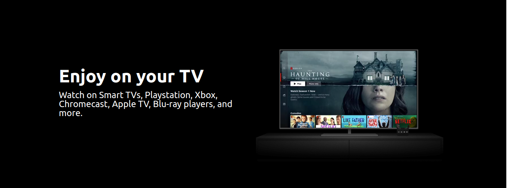

# Netflix Clone

**Description**: This project is a simple Netflix clone built using HTML and CSS. It replicates some of the basic functionality and design elements of the Netflix website for educational purposes and as a demonstration of web development skills. 

**Disclaimer**: This project is not affiliated with, endorsed, or sponsored by Netflix. It is purely a learning and educational exercise.





## Table of Contents

- [Features](#features)
- [Installation](#installation)
- [Usage](#usage)
- [Contributing](#contributing)
- [License](#license)
- [Acknowledgments](#acknowledgments)
- [Author](#author)

## Features

- Responsive design that adapts to various screen sizes.
- Netflix-like user interface with a header, hero section, feature highlights, and FAQ section.
- Interactive FAQ section with collapsible questions and answers.
- A form for entering an email to start or restart a Netflix membership.

## Installation

1. Clone the repository to your local machine:

    ```bash
    git clone https://github.com/PubuduAriyawansha/Netflix-Clone.git
    ```

2. Open the project in a web browser:

    ```bash
    cd netflix-clone
    open index.html
    ```

## Usage

You can view the Netflix clone in your web browser after opening the index.html file. Feel free to modify the HTML and CSS code to suit your needs or use this project as a template for your own website. 

## Contributing

Contributions are welcome! If you'd like to contribute to this project, please follow these guidelines:

1. Fork the repository.
2. Create a new branch for your feature or bug fix: `git checkout -b feature-name`.
3. Make your changes and commit them: `git commit -m 'Add new feature'`.
4. Push to the branch: `git push origin feature-name`.
5. Submit a pull request with a clear description of your changes.

## License

This project is open-source and available under the [MIT License](License.txt).

## Acknowledgments

- Images and icons used in this project are for demonstration purposes only and may be subject to copyright. Please replace them with appropriate assets in a production environment.

## Author

- [Pubudu Ariyawansha](https://github.com/PubuduAriyawansha)

---

**Note:** This project is a basic YouTube clone and is intended for educational purposes. It is not a complete or functional video-sharing platform.


